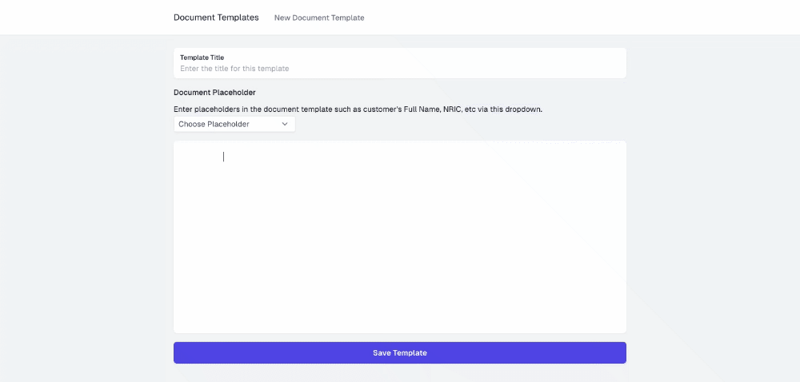

# Installation
- run ```npm install```
- create a new mysql database for this demo. kalau tengok dalam .env saya letak nama database sebagai 'document_templates'
- run ```npm run migration:run```
- make sure datatype untuk column 'content' ialah JSON.
- change your db settings in .env
- run ```npm run start:dev```

# Other Notes
- Boleh download Client app (NextJS) di [sini](https://github.com/uzzairatinvoke/pactonline-document-builder-client).
- Kalau nak tengok API Doc boleh pergi ke [http://localhost:5775/swagger](http://localhost:5775/swagger)
- Kalau nak import collection dalam Insomnia pergi ke [http://localhost:5775/swagger/json](http://localhost:5775/swagger/json). Dekat situ korang copy and paste JSON yang korang nampak tu dalam importer Insomnia.
